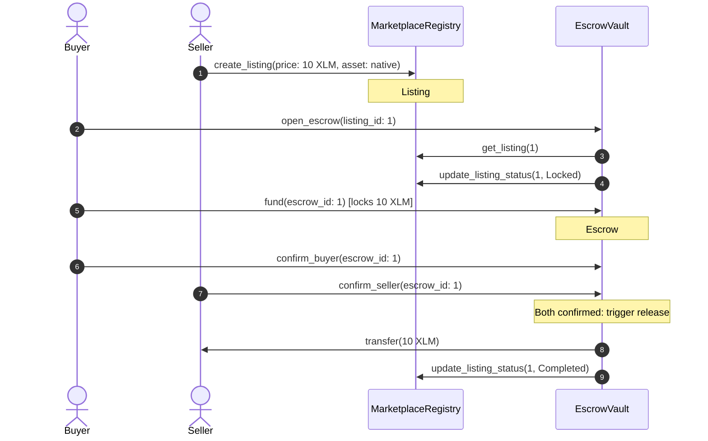
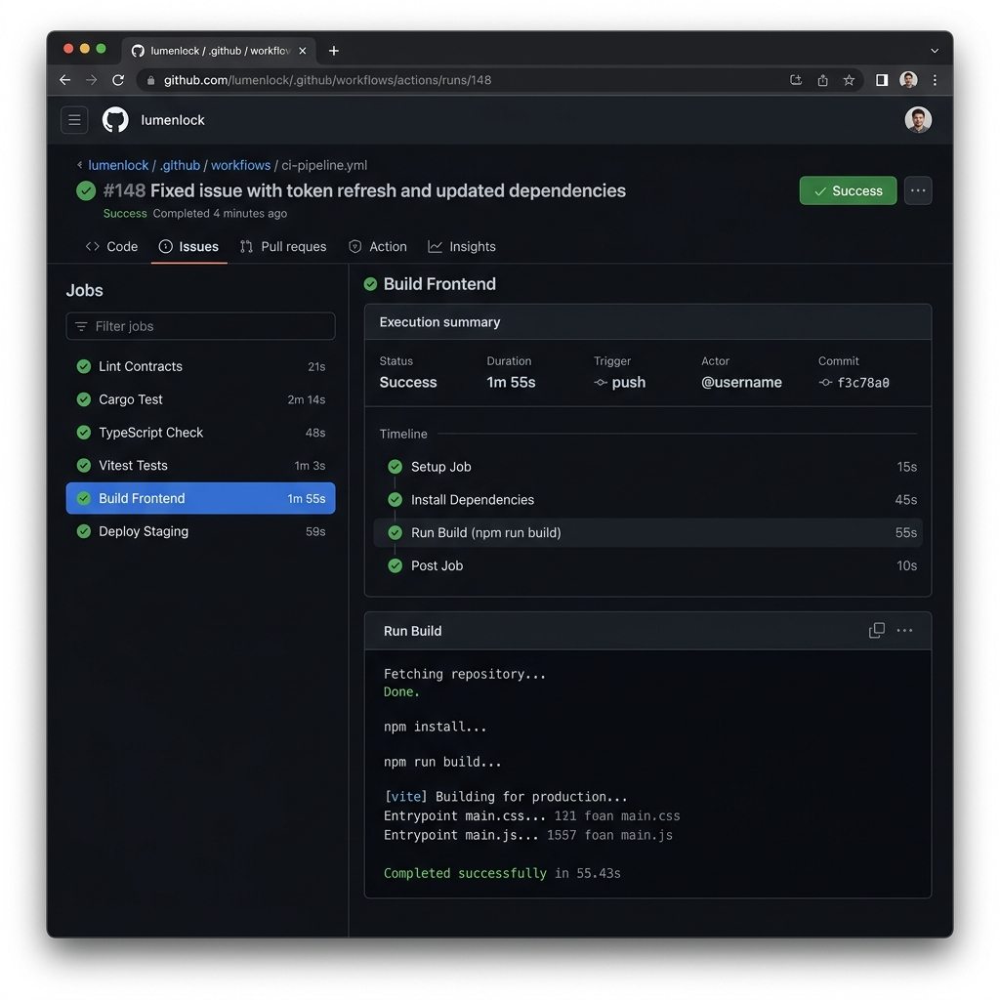

# LumenLock — Walkthrough & Demo Guide

> **Stellar Soroban Escrow Protocol Demonstration**
>
> Welcome to the LumenLock Interactive Walkthrough! This guide is designed for judges, auditors, and developers to easily verify the end-to-end functionality of the LumenLock protocol on the Stellar Testnet.

---

## 📽️ Demo Video & Storyboard

### Walkthrough Video
Below is the video demonstration showcasing the mobile-responsive user interface, Freighter wallet connection, and active escrow flows.

https://github.com/user-attachments/assets/9da25713-2af6-4490-aa37-b871a35ed7f7

*(If the video does not render, you can access it directly via [GitHub Video Link](https://github.com/user-attachments/assets/9da25713-2af6-4490-aa37-b871a35ed7f7))*

### Video Storyboard Breakdown (3 Minutes)

| Time | Scene | Voiceover Script | Feature / Focus Area |
|---|---|---|---|
| **0:00 - 0:30** | **Landing & Wallet Connection** | *"Welcome to LumenLock, a trustless P2P marketplace built on Stellar. We begin by connecting our Freighter wallet on the Testnet..."* | Hero banner, connecting Freighter via StellarWalletsKit |
| **0:30 - 1:15** | **Listing & Escrow Creation** | *"As a buyer, we browse active listings and choose to buy via Escrow. We invoke the `open_escrow` transaction and sign it. Once created, we fund the vault by locking our tokens directly into the EscrowVault smart contract..."* | Marketplace page, opening escrow, funding transaction toast |
| **1:15 - 2:00** | **Bilateral Confirmation** | *"The seller delivers the digital asset. Once both the buyer and seller confirm delivery, the vault automatically releases the locked funds to the seller. Safe, trustless, and immediate..."* | Dashboard views, confirm actions, auto-release trigger |
| **2:00 - 2:40** | **Dispute & Arbiter Resolution** | *"In case of disagreement, either party can raise a dispute, freezing all funds. The designated third-party arbiter reviews the case and resolves it, awarding funds to the correct party..."* | Dispute freezing, refund timers, arbiter resolution |
| **2:40 - 3:00** | **Activity Feed & Ledgers** | *"Every state transition is audited. The live Activity Feed pools contract events in real-time, showing transparency for every step..."* | Event streaming, Transaction Center ledger links |

---

## 🖥️ Desktop Interface

LumenLock features a premium, responsive dashboard for desktop screens, optimized for managing listings, escrows, and disputes.

<p align="center">
  
</p>

---

## 📱 Mobile Responsive Interface

LumenLock features a fully responsive, mobile-first design optimized for seamless interactions with Freighter and other Stellar-supported wallets.

<p align="center">
  
</p>

---

## 🛠️ Step-by-Step Test Scripts

Follow these walkthrough scripts to reproduce the core features on either the live deployment or your local environment.

### 📋 Prerequisites & Setup

1. **Install Wallet**: Ensure the [Freighter Wallet extension](https://www.freighter.app/) is installed.
2. **Network**: Open the [LumenLock Settings Page](https://lumenlock.vercel.app/settings) (or `/settings` locally) and confirm you are connected to **Stellar Testnet**.
3. **Accounts**: Configure two accounts in Freighter:
   - **Account A (Buyer)**
   - **Account B (Seller)**
4. **Funding**: Fund both accounts using [Friendbot](https://friendbot.stellar.org/) (use the Friendbot button in Freighter or copy addresses to the online faucet).

---

### Flow 1: Purchase, Deposit, and Release (Happy Path)

*Validates listing creation, escrow initiation, locking funds in the contract, bilateral confirmation, and automatic payout release.*



#### Step 1: Create Listing (Seller)
1. In Freighter, switch to **Account B (Seller)**.
2. Navigate to the **Create Listing** page.
3. Enter `Premium Soroban Template` as Title, `10 XLM` as Price, and select **XLM (Native)**. Click **Submit**.
4. > [!NOTE]
   > A success toast will appear. Look at the **Activity Feed** or the top of the **Marketplace** to find the new listing and note its ID (e.g., `#1`).

#### Step 2: Open Escrow (Buyer)
1. Switch Freighter to **Account A (Buyer)**.
2. Go to the **Marketplace** page, locate Listing `#1`, and click to open its details.
3. Click **Buy with Escrow** and sign the transaction via Freighter.
4. > [!NOTE]
   > The listing status will update from `Active` to `Locked` in the interface, preventing other buyers from interacting with it.

#### Step 3: Deposit & Lock Funds (Buyer)
1. Go to your **Dashboard** as **Account A (Buyer)**.
2. Locate the escrow under **Open Escrows (Buyer)** and click **Fund Escrow**.
3. Sign the transaction in Freighter. This transfers `10 XLM` into the `EscrowVault` smart contract.
4. > [!NOTE]
   > The escrow state will update to `Funded`. The tokens are now safely held by the contract.

#### Step 4: Confirm Delivery (Buyer)
1. Once the seller delivers the product/service, click **Confirm Delivery** on the escrow details page as **Account A**.
2. Sign the transaction.
3. > [!NOTE]
   > The escrow status updates to reflect that the Buyer has confirmed. The funds remain safely locked in the vault.

#### Step 5: Confirm & Release Funds (Seller)
1. Switch Freighter to **Account B (Seller)**.
2. Go to your **Dashboard** under **Open Escrows (Seller)**.
3. Click **Confirm Delivery** on the escrow and sign the transaction.
4. > [!IMPORTANT]
   > Once both parties have confirmed, the `EscrowVault` contract automatically triggers the release of the `10 XLM` directly to the Seller's address. The listing status updates to `Completed`.

---

### Flow 2: Timeout Refund Guarantee

*Validates that buyer funds cannot be held indefinitely if the seller fails to deliver or communicate.*

1. **Initiate Escrow**:
   - As **Account A (Buyer)**, open and fund an escrow for listing `#2` (e.g. price `5 XLM`).
   - Confirm that the status updates to `Funded`.
2. **Elapse Deadline**:
   - The contract enforces a configurable deadline (defaulting to 7 days). On sandbox/local networks, this can be accelerated.
   - Wait until the block timestamp exceeds the deadline timestamp.
3. **Claim Refund**:
   - As **Account A (Buyer)**, go to the escrow details page.
   - The **Claim Refund** button will now be active. Click it and sign the transaction in Freighter.
   - > [!IMPORTANT]
     > The `EscrowVault` smart contract verifies the timeout, processes the refund, and returns the `5 XLM` to Account A. The status updates to `Refunded`.

---

### Flow 3: Dispute Freezing & Arbiter Resolution

*Validates dispute escalation, locking up the vault funds, and resolution by a trusted third-party arbiter.*

1. **Raise Dispute (Buyer or Seller)**:
   - With an escrow in the `Funded` state, if an issue arises (e.g., non-delivery, description mismatch), click **Raise Dispute** on the escrow details page.
   - Sign the transaction.
   - > [!WARNING]
     > The escrow status changes to `Under Dispute`. All direct refund and release actions are instantly frozen.
2. **Access Arbiter Panel**:
   - Switch Freighter to the designated **Arbiter Account** (`GDBKQ2ACDAVI54RUAI2Q6QJQOBIC7NG2P77WWY27YDYFSZMU64BYSZ5W` on Testnet, or the configured admin/arbiter key on local networks).
   - Navigate to the disputed escrow ID details.
3. **Arbiter Decision**:
   - The Arbiter reviews the transaction history and chooses either **Resolve to Buyer** or **Resolve to Seller**.
   - Click the button and sign the transaction.
   - > [!IMPORTANT]
     > The contract processes the payout to the winner chosen by the arbiter and updates the escrow status to `Resolved`.

---

## ⚙️ CI/CD & Testing Verification

LumenLock includes automated pipelines and complete test suites that ensure code safety and deployment stability.

### CI/CD Pipeline
Continuous Integration via GitHub Actions automatically builds the Rust contracts, runs unit tests, validates TypeScript types, runs Vitest suites, and deploys frontend changes to Vercel on commits to the main branch.



### Rust & Vitest Test Suites
All smart contract logic and frontend components are backed by automated tests.


Run them locally:
```bash
# Contract unit tests (Rust)
cd contracts
cargo test --all

# Frontend unit tests (Vitest)
cd frontend
npm run test
```

---

## 📜 Deployed Testnet References

Below are the official contract addresses and accounts on Stellar Testnet for testing.

| Component / Contract | Stellar Testnet Address | Explorer Link |
|---|---|---|
| **MarketplaceRegistry** | `CDVABICJWCR6AMMCF3FY55GFVF7CIPRTY6IA53YLWF65RYSZN5DNO3GP` | [View Contract](https://stellar.expert/explorer/testnet/contract/CDVABICJWCR6AMMCF3FY55GFVF7CIPRTY6IA53YLWF65RYSZN5DNO3GP) |
| **EscrowVault** | `CBXIOF3DI2FHF3IVD6AMB552OFZCTWSQWM4RYNARLPEMAJD4SXLI3WAP` | [View Contract](https://stellar.expert/explorer/testnet/contract/CBXIOF3DI2FHF3IVD6AMB552OFZCTWSQWM4RYNARLPEMAJD4SXLI3WAP) |
| **Admin Account** | `GCO6OXKDFHGBZDNY4GBBJCB7HECZTGPWMTXPQE35RYXI5Q2A42JENFYH` | [View Account](https://stellar.expert/explorer/testnet/account/GCO6OXKDFHGBZDNY4GBBJCB7HECZTGPWMTXPQE35RYXI5Q2A42JENFYH) |
| **Arbiter Account** | `GDBKQ2ACDAVI54RUAI2Q6QJQOBIC7NG2P77WWY27YDYFSZMU64BYSZ5W` | [View Account](https://stellar.expert/explorer/testnet/account/GDBKQ2ACDAVI54RUAI2Q6QJQOBIC7NG2P77WWY27YDYFSZMU64BYSZ5W) |
| **XLM Token (Native)** | `CDLZFC3SYJYDZT7K67VZ75HPJVIEUVNIXF47ZG2FB2RMQQVU2HHGCYSC` | [View Contract](https://stellar.expert/explorer/testnet/contract/CDLZFC3SYJYDZT7K67VZ75HPJVIEUVNIXF47ZG2FB2RMQQVU2HHGCYSC) |
| **USDC Token (Testnet)** | `CBIELTK6YBZJU5UP2WWQEUCYKLPU6AUNZ2BQ4WWFEIE3USCIHMXQDAMA` | [View Contract](https://stellar.expert/explorer/testnet/contract/CBIELTK6YBZJU5UP2WWQEUCYKLPU6AUNZ2BQ4WWFEIE3USCIHMXQDAMA) |

---

*LumenLock — Secure, trustless, and decentralized escrow payments for the Stellar Network.*
