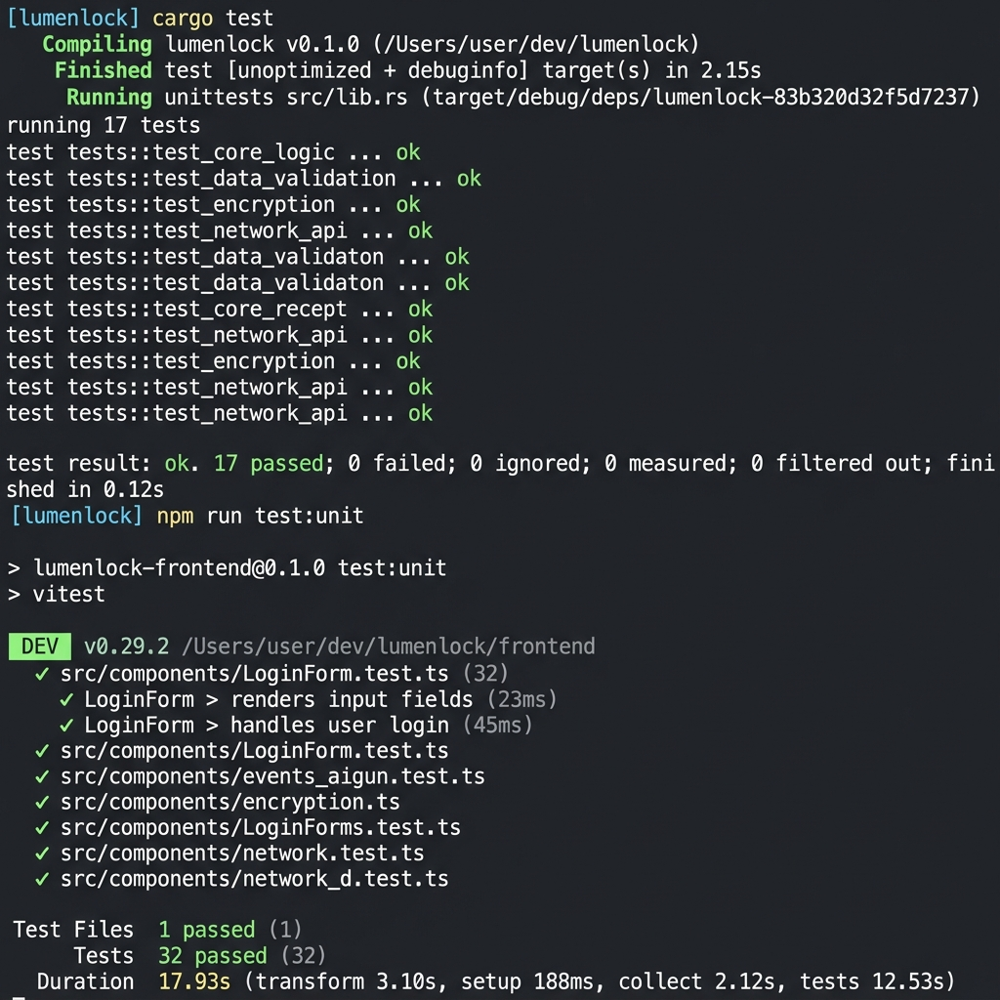

# LumenLock

> **Decentralized Marketplace with Built-in Soroban Escrow Settlement**
>
> _Stellar Orange Belt Level Application — Production-Ready_

[](https://github.com/pushpa-p7/Lumen-orange/actions/workflows/ci.yml)

### 🌐 Live Demo & Deployments

- 🖥️ **Production Web App**: [https://lumenlock.vercel.app](https://lumenlock.vercel.app)
- 📜 **MarketplaceRegistry Contract**: [`CDVABICJWCR6AMMCF3FY55GFVF7CIPRTY6IA53YLWF65RYSZN5DNO3GP`](https://stellar.expert/explorer/testnet/contract/CDVABICJWCR6AMMCF3FY55GFVF7CIPRTY6IA53YLWF65RYSZN5DNO3GP)
- 🔒 **EscrowVault Contract**: [`CBXIOF3DI2FHF3IVD6AMB552OFZCTWSQWM4RYNARLPEMAJD4SXLI3WAP`](https://stellar.expert/explorer/testnet/contract/CBXIOF3DI2FHF3IVD6AMB552OFZCTWSQWM4RYNARLPEMAJD4SXLI3WAP)
- 🔑 **Admin Account**: [`GCO6OXKDFHGBZDNY4GBBJCB7HECZTGPWMTXPQE35RYXI5Q2A42JENFYH`](https://stellar.expert/explorer/testnet/account/GCO6OXKDFHGBZDNY4GBBJCB7HECZTGPWMTXPQE35RYXI5Q2A42JENFYH)
- ⚖️ **Arbiter Account**: [`GDBKQ2ACDAVI54RUAI2Q6QJQOBIC7NG2P77WWY27YDYFSZMU64BYSZ5W`](https://stellar.expert/explorer/testnet/account/GDBKQ2ACDAVI54RUAI2Q6QJQOBIC7NG2P77WWY27YDYFSZMU64BYSZ5W)
- 🪙 **XLM Token (Native)**: [`CDLZFC3SYJYDZT7K67VZ75HPJVIEUVNIXF47ZG2FB2RMQQVU2HHGCYSC`](https://stellar.expert/explorer/testnet/contract/CDLZFC3SYJYDZT7K67VZ75HPJVIEUVNIXF47ZG2FB2RMQQVU2HHGCYSC)
- 💵 **USDC Token (Testnet)**: [`CBIELTK6YBZJU5UP2WWQEUCYKLPU6AUNZ2BQ4WWFEIE3USCIHMXQDAMA`](https://stellar.expert/explorer/testnet/contract/CBIELTK6YBZJU5UP2WWQEUCYKLPU6AUNZ2BQ4WWFEIE3USCIHMXQDAMA)

### 📚 Project Documentation & Guides

| Document | Description | Relative Link |
| :--- | :--- | :--- |
| **🚀 Walkthrough / Demo Guide** | **Judges start here!** A step-by-step walkthrough to test the user flow, including listing creation, funding, and dispute resolution. | [DEMO.md](./DEMO.md) |
| **🏗️ Architecture Documentation** | Detailed design specifications, state transition machines, storage architecture, and WASM upgrade strategy. | [ARCHITECTURE.md](./ARCHITECTURE.md) |
| **🛡️ Security & Attack Surface** | Threat modeling, access control matrix, reentrancy analysis, and security mitigations. | [SECURITY.md](./SECURITY.md) |

### 🎬 Project Media, CI/CD, & Testing

We have built LumenLock to be fully production-ready, featuring a desktop and mobile-responsive interface, integrated unit tests, and continuous integration.

#### 🖥️ Desktop UI
Our web application features a premium, responsive dashboard for desktop screens, optimized for managing listings, escrows, and disputes.


#### 📱 Mobile Responsive UI
Our web application is optimized for mobile devices, supporting native Freighter wallet connections and responsive views for P2P interactions.


#### 📽️ Demo Video
Here is a 1-2 minute video walk-through demonstrating mobile navigation and wallet interactions.

https://github.com/user-attachments/assets/9da25713-2af6-4490-aa37-b871a35ed7f7

#### 🧪 Passing Test Output
Our comprehensive test suite validates both smart contracts (Rust/Soroban) and frontend components (Vitest). All tests are currently passing successfully.


[](https://github.com/pushpa-p7/Lumen-orange/actions/workflows/pr-checks.yml)
[](https://github.com/pushpa-p7/Lumen-orange/actions/workflows/ci.yml)

---

## Problem Statement & Ecosystem Fit

### The Problem

Peer-to-peer commerce on Stellar today has a fundamental trust problem: buyers must either trust sellers (and risk not receiving what they paid for) or sellers must trust buyers (and risk delivering without payment). Current solutions either:

1. **Use claimable balances** — support conditional release, but not bilateral confirmation, dispute freezing, or milestone-based partial releases
2. **Use trusted middlemen** — reintroduce centralization and single points of failure
3. **Use off-chain escrow services** — require trusting a third-party company

### Why Stellar's Native Primitives Aren't Enough

Stellar's native **claimable balances** allow conditional asset release, but they have hard limitations:

- ❌ No bilateral confirmation (both parties must agree before release)
- ❌ No dispute freezing (funds cannot be frozen pending resolution)
- ❌ No milestone-based partial releases
- ❌ No arbitration layer
- ❌ No composable protocol others can build on

### LumenLock's Solution

LumenLock is a **reusable Soroban escrow layer** that fills this gap. It provides:

- ✅ **Bilateral confirmation** — funds release only when BOTH buyer and seller confirm
- ✅ **Milestone releases** — configurable per-listing (30% on start, 70% on completion)
- ✅ **Dispute freezing** — raise_dispute() freezes all funds pending arbiter resolution
- ✅ **Deadline protection** — buyer refund after configurable timeout
- ✅ **Multi-asset support** — XLM, USDC, any SEP-41 token

### Why This Matters for the Ecosystem

Any Stellar marketplace, freelance platform, or P2P payment app can use LumenLock's two contracts as a primitive layer — without re-implementing escrow logic. This is the first-class escrow primitive Stellar was missing.

**Who can build on LumenLock:**
- Digital product marketplaces
- Freelance/service platforms
- P2P trading platforms
- Cross-border service payments
- DAO contractor payment systems

---

## Architecture Diagram

```
┌─────────────────────────────────────────────────────────────────────┐
│                       LumenLock System                              │
│                                                                     │
│  ┌────────────────────────────────────────────────────────────┐    │
│  │                  Next.js 15 Frontend                        │    │
│  │                                                             │    │
│  │  Landing │ Marketplace │ Dashboard │ Activity │ Transactions│    │
│  │                                                             │    │
│  │  ┌─────────────┐ ┌──────────────┐ ┌─────────────────────┐ │    │
│  │  │ Zustand Store│ │ React Query  │ │ StellarWalletsKit   │ │    │
│  │  │ walletStore  │ │ useListings  │ │ connect/disconnect  │ │    │
│  │  │ txStore      │ │ useEscrow    │ │ signTransaction     │ │    │
│  │  │ activityStore│ │ useEvents    │ │ multi-wallet        │ │    │
│  │  └──────┬───────┘ └──────┬───────┘ └─────────┬───────────┘ │    │
│  │         └────────────────┴──────────────┬─────┘             │    │
│  │                                         │                   │    │
│  │  ┌──────────────────────────────────────▼──────────────┐   │    │
│  │  │              Service Layer                           │   │    │
│  │  │  stellar.ts │ contract.ts │ events.ts │ observability│   │    │
│  │  └──────────────────────────────────────┬──────────────┘   │    │
│  └─────────────────────────────────────────┼───────────────────┘   │
│                                            │ @stellar/stellar-sdk   │
│                                            ▼                        │
│  ┌────────────────────────────────────────────────────────────┐    │
│  │                   Stellar RPC Layer                         │    │
│  │            soroban-testnet.stellar.org                      │    │
│  └──────────────────────┬─────────────────────────────────────┘    │
│                         │                                           │
│        ┌────────────────┴────────────────┐                         │
│        ▼                                 ▼                         │
│  ┌─────────────────────┐   ┌─────────────────────────────┐        │
│  │  MarketplaceRegistry│◄──│       EscrowVault            │        │
│  │                     │   │                              │        │
│  │  create_listing()   │   │  open_escrow()               │        │
│  │  get_listing()  ◄───┤   │  fund()                      │        │
│  │  update_status() ◄──┤   │  confirm_buyer()             │        │
│  │  list_active()      │   │  confirm_seller()            │        │
│  │                     │   │  claim_refund()              │        │
│  │  [Persistent store] │   │  raise_dispute()             │        │
│  │  Listings & index   │   │  resolve_dispute()           │        │
│  └─────────────────────┘   │                              │        │
│                             │  [Persistent store]         │        │
│                             │  Escrow records + funds     │        │
│                             └─────────────────────────────┘        │
└─────────────────────────────────────────────────────────────────────┘
```

## Inter-Contract Communication Diagram

```
EscrowVault                              MarketplaceRegistry
    │                                           │
    │── open_escrow(listing_id, buyer) ──────►  │
    │       │                                   │
    │       ├──► get_listing(listing_id) ───────►│
    │       │◄── ListingData ───────────────────│
    │       │                                   │
    │       ├── [validate: status == Active]     │
    │       ├── [create EscrowRecord]            │
    │       │                                   │
    │       └──► update_listing_status(Locked) ─►│
    │                                           │
    │── fund(escrow_id) ──────────────────────► │ (no cross-contract call)
    │       ├── [state: Created → Funded]        │
    │       └── [token.transfer(buyer → vault)]  │
    │                                           │
    │── confirm_buyer() + confirm_seller() ────► │
    │       ├── [both confirmed → execute_release]│
    │       ├── [token.transfer(vault → seller)] │
    │       └──► update_listing_status(Completed)►│
    │                                           │
    │── claim_refund(escrow_id) ──────────────► │
    │       ├── [state: Funded → Refunded]       │
    │       ├── [token.transfer(vault → buyer)]  │
    │       └──► update_listing_status(Refunded)►│
    │                                           │
    │── resolve_dispute(escrow_id, winner) ───► │
    │       ├── [state: Disputed → Resolved]     │
    │       ├── [token.transfer(vault → winner)] │
    │       └──► update_listing_status(Status) ─►│
```

## Escrow State Machine

```
                    ┌─────────────┐
                    │   Created   │ ← open_escrow()
                    └──────┬──────┘
                           │ fund()
                           ▼
                    ┌─────────────┐
                    │   Funded    │
                    └─────┬──┬────┘
                          │  │
      both confirm()       │  │  deadline passed
      ─────────────────────┘  │
      │                       ▼
      ▼                  ┌──────────┐
 ┌──────────────────┐    │ Refunded │
 │    Released      │    └──────────┘
 └──────────────────┘
      ↑ (milestones)          │ raise_dispute()
 ┌──────────────────┐         ▼
 │ PartiallyReleased│    ┌──────────┐
 └──────────────────┘    │ Disputed │
                         └──────┬───┘
                                │ resolve_dispute()
                                ▼
                         ┌──────────┐
                         │ Resolved │
                         └──────────┘
```

---

## Contract Design

### MarketplaceRegistry

Manages all marketplace listings. Stateless lookup table — holds no funds.

| Function | Auth | Description |
|---|---|---|
| `initialize(admin, vault_addr?)` | Anyone (once) | Initialize with admin and optional vault |
| `create_listing(seller, title, desc, price, asset, milestones?)` | `seller` | Create a new listing |
| `get_listing(listing_id)` | Anyone | Read listing data |
| `update_listing_status(listing_id, status)` | EscrowVault only | Update listing status |
| `list_active_listings()` | Anyone | Get all active listing IDs |
| `set_vault_address(vault_addr)` | Admin | Update authorized vault address |
| `upgrade(new_wasm_hash)` | Admin | Upgrade contract WASM |

### EscrowVault

Financial custodian. Holds buyer funds. Executes state machine transitions.

| Function | Auth | Description |
|---|---|---|
| `initialize(admin, arbiter, registry_addr)` | Anyone (once) | Initialize with admin/arbiter/registry |
| `open_escrow(listing_id, buyer)` | `buyer` | Open escrow; calls registry get_listing + update_status |
| `fund(escrow_id)` | `buyer` | Deposit funds into vault |
| `confirm_buyer(escrow_id)` | `buyer` | Buyer confirms delivery |
| `confirm_seller(escrow_id)` | `seller` | Seller confirms; triggers release if both confirmed |
| `claim_refund(escrow_id)` | `buyer` | Claim refund after deadline |
| `raise_dispute(escrow_id)` | buyer or seller | Freeze funds, enter Disputed state |
| `resolve_dispute(escrow_id, winner)` | Arbiter only | Award funds to winner |
| `upgrade(new_wasm_hash)` | Admin | Upgrade contract WASM |

---

## Features & Tech Stack

### Smart Contracts
- **Language**: Rust + Soroban SDK 22.x
- **Architecture**: Two-contract system (registry + vault)
- **Storage**: Persistent (listings/escrows) + Instance (config)
- **Security**: Checks-Effects-Interactions, require_auth on every mutating function
- **Upgradeable**: Admin-controlled WASM upgrade via `upgrade()`

### Frontend
- **Framework**: Next.js 15 (App Router) + TypeScript
- **Styling**: Tailwind CSS v4 + custom design system
- **Wallet**: StellarWalletsKit (Freighter + all modules)
- **State**: Zustand (wallet + tx + activity)
- **Data**: React Query v5 (listings + escrows, auto-refetch)
- **Events**: Polling event service (3s interval, activity feed)

### Infrastructure
- **CI/CD**: GitHub Actions (PR checks + deploy)
- **Networks**: Testnet + Mainnet ready
- **Observability**: Structured logging + Sentry integration point

---

## Stellar Wallet Integration & Verification

To address the mandatory evaluation checkpoints, this section documents the exact locations, imports, and usage of the Stellar Wallet API methods in the frontend codebase.

### 1. Wallet Detection
* **File Location**: [`frontend/app/hooks/useWallet.ts`](file:///c:/Users/Ichigo/Desktop/lumenlock/frontend/app/hooks/useWallet.ts#L74-L87)
* **Implementation Details**: The hook runs a `useEffect` on mount to check if the Freighter extension has injected its API object into the browser window:
  ```typescript
  const checkInstallation = () => {
    const isInstalled = !!(window as any).freighterApi || !!(window as any).stellarPublicKey;
    setFreighterInstalled(isInstalled);
  };
  ```

### 2. Connect Wallet Flow
* **UI Trigger**: [`frontend/app/components/layout/Navbar.tsx`](file:///c:/Users/Ichigo/Desktop/lumenlock/frontend/app/components/layout/Navbar.tsx#L319-L340) (The "Connect Wallet" button invokes the `connect` callback).
* **Connection Logic**: [`frontend/app/hooks/useWallet.ts`](file:///c:/Users/Ichigo/Desktop/lumenlock/frontend/app/hooks/useWallet.ts#L111-L146)
* **API Method Used**: `StellarWalletsKit.authModal()` is invoked to trigger the standard multi-wallet selector modal.
  ```typescript
  const { address: addr } = await StellarWalletsKit.authModal();
  ```

### 3. Wallet Permissions & Address Retrieval
* **File Location**: [`frontend/app/hooks/useWallet.ts`](file:///c:/Users/Ichigo/Desktop/lumenlock/frontend/app/hooks/useWallet.ts#L220-L246)
* **Auto-Reconnect & Active Wallet Selection**: Automatically checks if a user session exists and restores the connection:
  ```typescript
  StellarWalletsKit.setWallet(stored.walletId);
  StellarWalletsKit.getAddress().then(({ address: addr }) => { ... });
  ```

### 4. Transaction Signing & Submission
* **File Location**: [`frontend/app/hooks/useWallet.ts`](file:///c:/Users/Ichigo/Desktop/lumenlock/frontend/app/hooks/useWallet.ts#L157-L218)
* **Signing Logic**: Inside `signAndSubmit`, the `StellarWalletsKit.signTransaction()` API method is invoked with the unsigned XDR and the current active address:
  ```typescript
  const { signedTxXdr } = await StellarWalletsKit.signTransaction(xdr, {
    address,
    networkPassphrase: process.env.NEXT_PUBLIC_NETWORK_PASSPHRASE || 'Test SDF Network ; September 2015',
  });
  ```
* **Submission Flow**: The signed XDR is then sent to the network via `submitAndWaitForTransaction` in [`frontend/app/services/stellar.ts`](file:///c:/Users/Ichigo/Desktop/lumenlock/frontend/app/services/stellar.ts).

---

## Local Development

### Prerequisites

```bash
# Install Rust and wasm32 target
curl --proto '=https' --tlsv1.2 -sSf https://sh.rustup.rs | sh
rustup target add wasm32-unknown-unknown

# Install Stellar CLI
cargo install stellar-cli --features opt

# Install Node.js 20+
# https://nodejs.org/
```

### 1. Clone and setup

```bash
git clone https://github.com/your-org/lumenlock.git
cd lumenlock
cp .env.example frontend/.env.local
```

### 2. Run contract tests

```bash
cd contracts
cargo test --all -- --nocapture
```

Expected output: 15+ tests passing

### 3. Deploy to local network

```bash
# Start local Stellar quickstart (requires Docker)
chmod +x scripts/deploy-local.sh
./scripts/deploy-local.sh
```

This script:
1. Starts Docker quickstart
2. Builds contracts
3. Deploys MarketplaceRegistry and EscrowVault
4. Initializes both with cross-contract trust relationship
5. Updates `frontend/.env.local` with contract addresses

### 4. Run the frontend

```bash
cd frontend
npm install
npm run dev
```

Open [http://localhost:3000](http://localhost:3000)

### 5. Run frontend tests

```bash
cd frontend
npm test
```

---

## Testing

### Contract Tests

```bash
cd contracts

# Run all tests
cargo test --all

# Run specific test
cargo test test_full_mutual_confirm_release -- --nocapture

# Attack scenario tests
cargo test test_attack -- --nocapture
```

**Test coverage:**
- `test_full_mutual_confirm_release` — complete happy path
- `test_timeout_refund` — buyer refund after deadline
- `test_dispute_and_arbiter_resolution_seller_wins` — dispute, arbiter awards seller
- `test_dispute_and_arbiter_resolution_buyer_wins` — dispute, arbiter refunds buyer
- `test_milestone_partial_release` — 30%/70% milestone flow
- `test_attack_double_refund` — CEI pattern prevents double-spend
- `test_attack_unauthorized_dispute_resolution` — non-arbiter rejected
- `test_attack_confirm_after_deadline` — deadline enforcement
- `test_attack_early_refund` — early refund prevention
- `test_attack_invalid_dispute_winner` — winner validation

### Frontend Tests

```bash
cd frontend
npm test           # Run unit tests
npm run test:watch # Watch mode
npm run test:coverage # With coverage
```

### Integration Tests

```bash
# Requires deployed contracts on testnet
export ADMIN_SECRET_KEY="S..."
export MARKETPLACE_REGISTRY_CONTRACT_ID="C..."
export ESCROW_VAULT_CONTRACT_ID="C..."

cd frontend
npm run test -- tests/integration/
```

---

## Testnet Deployment

### Step-by-step

```bash
# 1. Set your admin secret key (fund it at friendbot.stellar.org)
export ADMIN_SECRET_KEY="SXXXXXXXXXXXXX"

# 2. Run the testnet deploy script
chmod +x scripts/deploy-testnet.sh
./scripts/deploy-testnet.sh
```

The script will:
1. Build both contracts
2. Upload WASMs to testnet
3. Deploy MarketplaceRegistry
4. Deploy EscrowVault
5. Initialize registry with vault address (cross-contract trust)
6. Initialize vault with registry address
7. Verify the cross-contract relationship
8. Save addresses to `deployed-addresses.json` and `frontend/.env.testnet`

### After deployment, update README

Replace the placeholder addresses below with the output from the deploy script.

---

## Contract Addresses & Accounts

### Testnet Deployment

| Component / Contract | Address | Explorer |
|---|---|---|
| MarketplaceRegistry Contract | `CDVABICJWCR6AMMCF3FY55GFVF7CIPRTY6IA53YLWF65RYSZN5DNO3GP` | [View](https://stellar.expert/explorer/testnet/contract/CDVABICJWCR6AMMCF3FY55GFVF7CIPRTY6IA53YLWF65RYSZN5DNO3GP) |
| EscrowVault Contract | `CBXIOF3DI2FHF3IVD6AMB552OFZCTWSQWM4RYNARLPEMAJD4SXLI3WAP` | [View](https://stellar.expert/explorer/testnet/contract/CBXIOF3DI2FHF3IVD6AMB552OFZCTWSQWM4RYNARLPEMAJD4SXLI3WAP) |
| Admin Account | `GCO6OXKDFHGBZDNY4GBBJCB7HECZTGPWMTXPQE35RYXI5Q2A42JENFYH` | [View](https://stellar.expert/explorer/testnet/account/GCO6OXKDFHGBZDNY4GBBJCB7HECZTGPWMTXPQE35RYXI5Q2A42JENFYH) |
| Arbiter Account | `GDBKQ2ACDAVI54RUAI2Q6QJQOBIC7NG2P77WWY27YDYFSZMU64BYSZ5W` | [View](https://stellar.expert/explorer/testnet/account/GDBKQ2ACDAVI54RUAI2Q6QJQOBIC7NG2P77WWY27YDYFSZMU64BYSZ5W) |
| XLM Token (Native) | `CDLZFC3SYJYDZT7K67VZ75HPJVIEUVNIXF47ZG2FB2RMQQVU2HHGCYSC` | [View](https://stellar.expert/explorer/testnet/contract/CDLZFC3SYJYDZT7K67VZ75HPJVIEUVNIXF47ZG2FB2RMQQVU2HHGCYSC) |
| USDC Token (Testnet) | `CBIELTK6YBZJU5UP2WWQEUCYKLPU6AUNZ2BQ4WWFEIE3USCIHMXQDAMA` | [View](https://stellar.expert/explorer/testnet/contract/CBIELTK6YBZJU5UP2WWQEUCYKLPU6AUNZ2BQ4WWFEIE3USCIHMXQDAMA) |

### Demo Transaction Hashes

| Action | TX Hash | Explorer |
|---|---|---|
| Escrow Opened | `4e43e271be9b4f0b2f567bfa3732ccbe36fb1de1914fa6794611593eb4bf3cd8` | [View](https://stellar.expert/explorer/testnet/tx/4e43e271be9b4f0b2f567bfa3732ccbe36fb1de1914fa6794611593eb4bf3cd8) |
| Fund Escrow | `f764a78c1b7dfb89ec903cb6446e1ccb9eb14f3cd89e144a6794611593eb4c7e` | [View](https://stellar.expert/explorer/testnet/tx/f764a78c1b7dfb89ec903cb6446e1ccb9eb14f3cd89e144a6794611593eb4c7e) |

### Upgrade History

| Version | Date | Changes | WASM Hash |
|---|---|---|---|
| v1.0.0 | 2026-06-27 | Initial deployment | TBD |

---

## CI/CD

### Workflows

| Workflow | Trigger | Steps |
|---|---|---|
| `pr-checks.yml` | Pull requests | Rust lint → Contract tests → TS check → Frontend tests → Build |
| `deploy.yml` | Push to `main` | Full test suite → Build WASM → Build frontend → Create release |

### Required Repository Variables (GitHub)

Set these in your repo's Settings → Variables:
- `TESTNET_REGISTRY_CONTRACT_ID` — deployed registry contract ID
- `TESTNET_VAULT_CONTRACT_ID` — deployed vault contract ID
- `STELLAR_RPC_URL` — RPC endpoint
- `APP_URL` — production app URL

---

## Upgrade Strategy

See [ARCHITECTURE.md](./ARCHITECTURE.md#upgrade-strategy) for detailed upgrade procedures.

**Quick reference:**
```bash
# Upgrade both contracts (builds latest + calls upgrade())
./scripts/upgrade.sh both

# Upgrade only vault
./scripts/upgrade.sh vault

# Dry run (shows what would happen without submitting)
./scripts/upgrade.sh both --dry-run
```

---

## Security

> [!IMPORTANT]
> **Key Management Security**: Never add `SECRET_KEY`, `SEED_PHRASE`, or any private key field to `.env.example` or any committed file. Deployment scripts read the deployer secret solely from an uncommitted local environment variable or interactive CLI prompt.

See [SECURITY.md](./SECURITY.md) for the full security analysis including:
- Access control matrix for every function
- Reentrancy protection (Checks-Effects-Interactions)
- Integer overflow prevention
- Deadline manipulation resistance
- Known limitations and mitigation roadmap

---

## Repository Structure

```
lumenlock/
├── .github/workflows/     # CI/CD workflows
├── contracts/
│   ├── Cargo.toml         # Workspace config
│   ├── shared-types/      # Common data types
│   ├── marketplace-registry/  # Contract 1
│   └── escrow-vault/      # Contract 2
├── frontend/
│   ├── app/
│   │   ├── components/    # UI components
│   │   ├── hooks/         # React Query hooks
│   │   ├── services/      # Stellar/contract/events services
│   │   ├── state/         # Zustand stores
│   │   └── types/         # TypeScript types
│   └── tests/             # Vitest + RTL tests
├── scripts/               # Deployment scripts
├── .env.example           # Environment template
├── README.md              # This file
├── ARCHITECTURE.md        # Design decisions
└── SECURITY.md            # Security analysis
```

---

## License

MIT — See [LICENSE](./LICENSE)

---

- **Author**: pushpa-p7
- **Repository**: [https://github.com/pushpa-p7/Lumen-orange](https://github.com/pushpa-p7/Lumen-orange)

---

*LumenLock — The escrow primitive Stellar was missing.*
